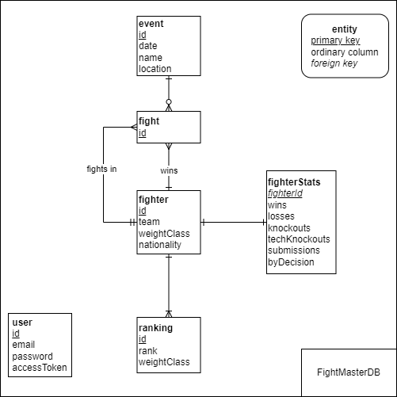

# FightMaster Documentation

## Setup and Running

To avoid all the overhead of setting up a database locally, I use a docker container where
I deploy the DB. 
- First, clone the repository.
You should have npm or nvm(which includes npm), Docker and Docker Compose on your machine, and run the following command to setup the app:

`docker compose up db -d`

*The docker compose config file automatically takes the required env variables from the respective file in the
path `<project-root>/env/db`.*

After you have deployed the db, I suggest you two options:

1) Deploy locally
   - Make sure you have the following dependency installed: `npm i -g @nestjs/cli
     `. Run the NestJS server on your local network interface. Install the dependency `npm install -g dotenv-cli` 
   to take the env 
   variables of the server (from the file `<project-root>/app/local.env`) and then run `npm run start`
   - From here, you can go to `http://localhost:3001/api` to check the documentation
   of the endpoints of the API.
1) Deploy in a Docker container
    - Run `docker compose up app`. The container will run in its network on the port 3001
   and expose it to the same port in localhost. Remember to check the
      API doc on `http://localhost:3001/api`.

The following is the EDR of the Database:

The script of the database can be found in the file `<project-root>/fight_master_db.sql`. 

## App Internal Architecture

The design of the application was made with a view to making its code base easily maintainable (extensible, modifiable, testable), with the help of SOLID principles and Clean Architecture concepts, proposed by software engineer Robert Martin.

The internal division is made in three layers whose limits and dependencies are clearly defined: Framework, which uses the constructs of the Node.js framework, NestJS, which among its main strengths is its Dependency Injection mechanism, which allows working with abstract elements (interfaces and Typescript types) and defining its implementation in a centralized way and allows the ease of extending the components of the code base.

The second layer is the DB layer, which as its name indicates, defines the elements and specifications necessary to implement data persistence in the application. In particular, TypeORM is used and entities representing the SQL database tables (in this case Postgres) are defined. Adaptors are used as a bridge between Core Repositories and specific ORM schemas.

The third and most important layer is the Core layer, where all the abstract elements that specify the needs at the business model level and the application functionality requirements are defined. Here specialized classes (Services) are defined, which are in charge of executing the application's functionality, as well as DTOs to represent the data required to cross layer boundaries, repositories and interfaces for the definition of persistence operations, and entities, which define the specific business rules.

Elements such as: Interactors, Gateways, Repositories, DTOs, Abstract Types, Generics, Adapters and Mappers, are used to define limited responsibilities for each of the code components, contributing to a cleaner, more cohesive design, with less coupling between modules and greater confidence in the code base, because with simpler designs the development experience is enhanced.
